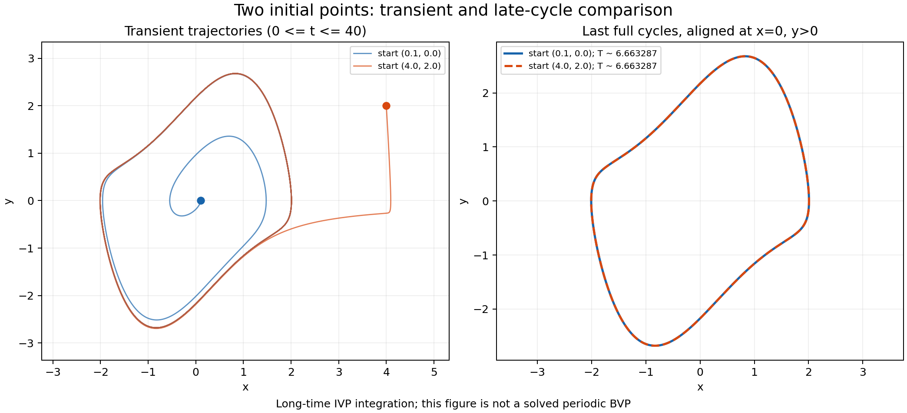

# Защита проекта: осциллятор Ван дер Поля и граничные невязки

Ли Чжохэн · GitHub: Zhu0heng

Изменения выполнены в существующем проекте BVP-Solver. Численные результаты
ниже относятся к двум начальным задачам; периодическая краевая задача
в данном эксперименте не решается.

## Запуск и результаты

Из корня проекта:

```powershell
python main.py --defense
```

На компьютере, где интерпретатор установлен в `D:\python.exe`:

```powershell
cd D:\2026zy
& D:\python.exe main.py --defense
```

Команда использует основной модуль запуска проекта, его `Dataset`, парсер
и `ContinuationSolver`. Она сохраняет график, два входных JSON и численные
диагностические данные в `defense_artifacts/`. Папку можно изменить аргументом
`--output-dir`. Повторный запуск обновляет эти четыре файла.

Обычный запуск интерфейса: `python main.py`. В меню Examples добавлены две задачи
Van der Pol. Их также можно открыть из сохранённых JSON. Каждая задача допускает
редактирование уравнений, начальной точки, интервала и точности. Для фазового
портрета выбрать X=`x1`, Y=`x2`. Команда `--defense` строит общий график двух
запусков и выполняет сравнение их последних циклов.



| Начальная точка | Интервал | Метод; rtol | Оценка периода | max boundary residual |
|---|---|---|---|---|
| (0.1, 0) | [0, 60] | DOP853; 1e-10 | 6.6632868594 | 0 |
| (4, 2) | [0, 60] | DOP853; 1e-10 | 6.6632868595 | 0 |

Первые 40 единиц времени показывают переходный процесс. После t=40 определяются
пересечения сечения x=0 в направлении y>0. Последний полный цикл каждой
траектории начинается на этом сечении. Сравнение проводится по одинаковой
нормированной фазе: это устраняет различие сдвигов по времени.

Максимальное расстояние между двумя сопоставленными циклами составляет примерно
5.04e-9. Изменения последних двух оценок периода меньше 4e-10. Результаты
получены из вычисленных траекторий, а не заданы константами.
Пересечения уточняются на кубическом интерполянте; оценка периода включает
ошибку интегрирования и интерполяции. Это численная проверка установления
режима, а не доказательство существования или единственности цикла.

## 1. Как система задана в программе?

В [task_io.py](task_io.py), функция `get_van_der_pol_tasks()`, обозначения
математической системы x и y заменены на x1 и x2:

```python
equations = [
    'Derivative(x1(t), t) - x2 = 0',
    'Derivative(x2(t), t) - ((1 - x1**2)*x2 - x1) = 0',
]
```

Для первой траектории заданы `x1(a)=0.1`, `x2(a)=0`; для второй
`x1(a)=4`, `x2(a)=2`. Условия на правом конце отсутствуют. Формально они
переданы через общий интерфейс граничных условий, но все условия стоят
на левом конце, поэтому математически это две задачи Коши.

[parser.py](parser.py), `parse_equation_system()` и `parse_boundary_conditions()`,
преобразует строки в численные функции после проверки разрешённого синтаксиса.
[solver.py](solver.py), `ContinuationSolver._ode_system()`, вычисляет правую часть.
[defense_experiment.py](defense_experiment.py), `compute_experiment()`, вызывает
`ContinuationSolver.solve()` для каждого набора данных. Начальное приближение
сразу удовлетворяет начальным условиям, поэтому `_continuation_path()` принимает
его без шагов продолжения и без решения вариационной системы.

Нелинейная часть `(1-x²)y` усиливает малые колебания и подавляет большие.
Для энергии E=(x²+y²)/2 выполняется E'=(1-x²)y²: при |x|<1 энергия
может возрастать, а при |x|>1 убывает. Это объясняет механизм установления
амплитуды, но само по себе ещё не доказывает единственность предельного цикла.
Точка (0,0) является равновесием, поэтому её не следует брать для демонстрации
выхода на цикл: точная траектория из неё остаётся в начале координат.

## 2. Что решает solve_ivp в этом эксперименте?

`solve_ivp` интегрирует ОДУ с известным начальным состоянием до заданного
времени 60. В `_phi()` он используется для оценки граничного отображения,
а в `_integrate_solution()` строит окончательную траекторию, возвращаемую
программой. Оба вызова находятся в [solver.py](solver.py).

В нашем запуске применён DOP853 с rtol=1e-10 и atol=1e-13. `n_points=6001`
задаёт сетку вывода, а не число внутренних шагов: внутренние шаги выбираются
адаптивно. `sol.sol(x_eval)` вычисляет плотный вывод на этой сетке.

`solve_ivp` не ищет неизвестный период и не обеспечивает условия замыкания.
Оценка периода получается позднее из интервалов между пересечениями сечения
в `defense_experiment.analyse_tail()`. Значение 60 является длительностью
наблюдения, а не периодом.

## 3. Является ли нарисованный цикл решением периодической краевой задачи?

Нет. Мы задали две начальные точки и наблюдали притяжение к одной замкнутой
кривой. В процессе вычислений не предъявлялись требования x(0)=x(T) и
y(0)=y(T), и неизвестный T не подбирался. Последний виток является численным
приближением установившегося режима, выделенным из длинной траектории.

В частности, `max boundary residual = 0` здесь означает выполнение двух
начальных условий. Это не нулевая погрешность ОДУ, не доказательство
периодичности и не невязка периодической краевой задачи. Проверка последних
пересечений и сравнение циклов записаны в `diagnostics.json` отдельно.

## 4. Чем периодические условия отличаются от начальной точки?

При начальных условиях задаются конкретные x(0)=x0, y(0)=y0.
Для регулярной правой части это определяет единственную локальную траекторию.

Периодические условия связывают два конца неизвестной траектории:

$$
R_1=x(T)-x(0)=0,\qquad R_2=y(T)-y(0)=0.
$$

Начальная точка на цикле обычно также неизвестна. Нужно подобрать её и,
возможно, T, чтобы траектория замкнулась. Поскольку система автономна,
сдвиг начала отсчёта вдоль одного цикла даёт то же периодическое движение.
Поэтому при поиске неизвестного периода необходимо фиксировать фазу.

## 5. Что изменить для поиска неизвестного периода T?

Сначала вводится нормированное время tau=t/T на фиксированном интервале [0,1].
Период включается в набор неизвестных, например как постоянное состояние x3:

$$
\frac{dx}{d\tau}=Ty,\qquad
\frac{dy}{d\tau}=T((1-x^2)y-x),\qquad
\frac{dT}{d\tau}=0.
$$

Три неизвестных начальных значения: p=(x(0),y(0),T). Условия:

$$
x(1)-x(0)=0,\quad y(1)-y(0)=0,\quad y(0)=0.
$$

Последнее условие фиксирует фазу. Дополнительно нужно требовать T>0,
ненулевую амплитуду, выбирать нужное направление пересечения, например
x(0)>0, и исключать равновесие. Начальное приближение можно получить из
наблюдаемого установившегося цикла. Следует проверять основной период:
условия замыкания могут выполняться и для нескольких оборотов.

В текущем проекте уже есть аналогичная идея с постоянным состоянием T
в примере 26.2: [task_io.py](task_io.py), `get_example_tasks()`, и
[gui.py](gui.py), `SolverThread._solve_limit_cycles()`.
Для трёхмерной постановки выше можно использовать общий `ContinuationSolver`
с новым набором уравнений и трёх условий. Для удобного интерфейса потребуется
добавить соответствующий пример, разбор трёх неизвестных и проверки
нетривиальности/положительного периода. Нельзя просто принудительно выбрать
старый специальный обработчик: он ожидает четыре компоненты и структуру
примера 26.2. В выполненном эксперименте этот дополнительный периодический
решатель не реализован: задание просит объяснить необходимые изменения.

## 6. Где и как вычисляется max boundary residual?

В [solver.py](solver.py), `_boundary_residual(start_state, end_state, lmbda)`,
вызываются функции `bc_funcs`, созданные из введённых условий. Возвращается
вектор R. Например, для `x1(b)=c` соответствующая компонента равна x1(b)-c.
Для связи `x1(a)=x1(b)` она равна x1(a)-x1(b).

Ранее вектор использовался для проверки и коррекции внутри решателя, но не
передавался в интерфейс. Теперь в конце `ContinuationSolver.solve()`, сразу
после окончательного `_integrate_solution()`, вычисляются:

```python
diagnostics = BoundaryDiagnostics(
    self._boundary_residual(y_eval[:, 0], y_eval[:, -1], final_lmbda),
    f'{self.dataset.continuation_param}={final_lmbda:g}',
)
```

`BoundaryDiagnostics.residuals` хранит копию значений R_i; свойство
`max_boundary_residual` вычисляет max(abs(R_i)). Значения проверяются
на конечность. Если окончательная траектория не проходит проверку,
успешный результат не возвращается. Диагностика сохраняется в
`solver.last_diagnostics`; при новом запуске она сначала сбрасывается.

Это корректное место, потому что R оценивается на начальном и конечном
состояниях **той самой траектории**, которую программа возвращает для графика,
при фактическом конечном параметре. Значение не берётся из промежуточной
итерации и не вычисляется независимым скриптом после завершения программы.
Модуль эксперимента только читает уже полученный `solver.last_diagnostics`.

### Передача в интерфейс и специальные задачи

В [gui.py](gui.py) изменён `SolverThread`:

- `_solve_kepler()` сохраняет диагностику принятой граничной дуги. Дополнительная
  полная орбита на графике не подменяет её конечную точку.
- `_solve_limit_cycles()` сохраняет отдельную диагностику каждого принятого цикла.
- `_solve_triple()` вычисляет все введённые граничные невязки по окончательным
  шести состояниям; добавленная строка управления u не входит в вектор состояния.
- `_solve_lens_control()` сохраняет невязки двух начальных условий, двух конечных
  условий и нормировки конечного сопряжённого вектора. Для этой задачи вектор
  включает дополнительное условие пристрелки, а не только четыре видимых условия.
- `run()` сохраняет диагностику общего решателя; `_solve_parameter_values()`
  переносит её для каждого параметра. Частичный набор сбрасывается при ошибке.

`MainWindow.create_solve_group()` добавляет видимый `residual_label`.
`MainWindow.on_solve_finished()` читает `boundary_diagnostics` рабочего потока
и показывает максимум по всем возвращённым решениям. Подсказка содержит
отдельные максимумы и векторы R. `MainWindow._clear_result()` удаляет старую
диагностику при изменении входных данных, новом запуске и ошибке.
Проверка ревизии входа не допускает отображения результатов устаревшего запуска.

В общем решателе конечный максимум должен быть не больше
max(1e-7,100*tol); специальные конечные проверки 26.3 и 26.4 используют
max(1e-6,100*tol). Результаты показываются как вычислены, а не округляются
принудительно до нуля. Малые невязки подтверждают выполнение условий,
но сами по себе не доказывают глобальную оптимальность или точность всей кривой.

## 7. Вариационная система в существующем коде

Пусть z(t;p) решает z'=f(t,z), z(t0;p)=p. При фиксированном внешнем
параметре введём матрицу чувствительности:

$$
X(t)=\frac{\partial z(t;p)}{\partial p},\qquad
X'(t)=f_z(t,z(t;p))X(t),\qquad X(t_0)=I.
$$

Компонента X_ij показывает, как изменится i-я компонента состояния при малом
изменении j-й компоненты начальных данных. В начальный момент z(t0;p)=p,
поэтому производная по p равна единичной матрице. X - матрица n на n;
она не является самой траекторией и не является матрицей граничных невязок.

Для двумерной системы Ван дер Поля аналитический Jacobian правой части имеет вид:

$$
f_z=\begin{pmatrix}0&1\\-2xy-1&1-x^2\end{pmatrix}.
$$

В проекте [solver.py](solver.py), `ContinuationSolver._state_jacobian()`,
вычисляет этот Jacobian **численно центральными разностями**, а не символьным
дифференцированием. Это следует отличать от SymPy-разбора самих уравнений.

Одновременное интегрирование реализовано в
`ContinuationSolver._integrate_state_and_variational(params, lmbda)`:

```python
z0 = np.concatenate([params, np.eye(n).ravel()])

def augmented(t, z):
    state = z[:n]
    transition = z[n:].reshape(n, n)
    derivative = np.asarray(self._ode_system(t, state, lmbda), dtype=float)
    state_jac = self._state_jacobian(t, state, lmbda)
    return np.concatenate([derivative, (state_jac @ transition).ravel()])
```

Здесь `z` содержит n компонент состояния и n² компонент матрицы X.
`transition` - X, `state_jac` - f_z. Один вызов `solve_ivp` интегрирует
обе части расширенной системы. Возвращаются конечное состояние и X(b).

Далее `ContinuationSolver._phi_jacobian()` вызывает `_boundary_partials()`
для получения R_a и R_b и составляет:

$$
\Phi(p)=R(p,z(b;p)),\qquad
\Phi'(p)=R_a+R_bX(b).
$$

Это правило дифференцирования сложной функции: изменение начальных данных
влияет на левую границу непосредственно и на правую через X(b).
В коде выражение имеет вид `jac = r_start + r_end @ transition`.

`_continuation_path()` использует `jac` в `np.linalg.lstsq` для шагов
внешнего продолжения, затем для корректирующих шагов Ньютона.
Идеальная непрерывная схема:

$$
\frac{dp}{d\mu}=-[\Phi'(p)]^+\Phi(p_0),\qquad p(0)=p_0,
$$

где плюс означает решение в смысле наименьших квадратов/псевдообратной.
В коде внешняя задача дискретизируется явным Эйлером, а конечный остаток
уменьшается коррекцией с уменьшением шага. При необходимости используется LM.
X позволяет получить производную граничного отображения для этой коррекции.

В конкретном начальном эксперименте Ван дер Поля начальные условия уже
выполнены, поэтому ранний выход из `_continuation_path()` пропускает
вариационное интегрирование. Наличие соответствующего метода в проекте
не означает, что он вызывается при каждом запуске. Для обычных нетривиальных
краевых задач он участвует в подборе неизвестных начальных данных.

## 8. Проверка и состав изменений

```powershell
python -m pytest tests/test_defense.py -q
python -m pytest -q
```

В `tests/test_defense.py` проверяются сходимость двух траекторий и согласие
между DOP853 и RK45, связь показанного R с конечной возвращённой траекторией,
отказ при испорченной окончательной интеграции, очистка диагностики в интерфейсе
и отдельные невязки для нескольких значений параметра. Существующий набор
тестов проверяет четыре исходных примера, изменение входов и разбор выражений.

Повторная проверка 25 сентября выявила две возможности ложного подтверждения:
одинаковые начальные точки принимались как два опыта, а разные системы с одной
геометрической орбитой могли совпадать после нормирования фазы, даже имея разные
периоды. Теперь `validate_experiment_inputs()` до интегрирования требует одну
систему, одинаковые параметры и интервал, а также разные начальные точки.
Сравнение уравнений консервативное: строки должны совпадать, символьная
эквивалентность не проверяется. Начальные условия эксперимента должны задавать
конечные числовые значения `x1(a)` и `x2(a)` по одному разу; порядок строк
не влияет на соответствие переменных. Расстояние между точками должно быть
больше 10% от max(1, нормы обеих точек). Это критерий демонстрационного
эксперимента, а не ограничение общего решателя краевых задач.

Проверка установившегося режима требует не менее трёх пересечений после t=40,
шаг вывода не более 1/100 оценённого периода, разность периодов двух запусков
меньше 1e-4 и расстояние сопоставленных циклов меньше 1e-3. Изменения двух
последних периодов и значений y на сечении также должны быть меньше 1e-4.
При недостаточной длительности или грубой сетке программа сообщает ошибку,
а не объявляет успех. Эти проверки не являются строгими оценками погрешности.

Новые тесты проверяют перестановку условий, неподходящие условия, равновесие,
короткий интервал, грубую сетку и изменение коэффициента при `(1-x1**2)*x2`
на 0.8 и 1.4. В последних двух опытах период и форма цикла действительно
изменяются; используется интервал [0,80]. Нельзя обещать установление режима
к t=60 после произвольного изменения системы. Отдельно численный Jacobian
сверен с аналитическим, а матрица X - с независимыми интегрированиями
возмущённых начальных задач.

Результат повторной проверки 25 сентября 2026 года: **279 passed** (полный
набор, 217.23 секунды), включая **17** тестов `tests/test_defense.py`.
Дополнительно проверен реальный QThread с доставкой
результата в GUI; поле показало вычисленный максимум. Сохранённый общий
фазовый портрет и размещение поля в интерфейсе проверены визуально.

Основные изменённые файлы: `solver.py`, `gui.py`, `task_io.py`, `main.py`.
Также дополнен `tests/test_material_audit.py`: невязки всех четырёх исходных
примеров сверяются с конечными состояниями каждого возвращённого слоя.
Новые файлы: `defense_experiment.py`, `tests/test_defense.py`, данный документ
и четыре воспроизводимых файла в `defense_artifacts/`.
Основное выполнение задания сохранено отдельным коммитом `da162b8`;
последующая проверка и усиление валидации оформляются отдельным коммитом.
Команда `git show --stat da162b8` показывает основной состав изменений,
`git diff a3adc72..HEAD` - суммарные изменения задания и последующей проверки.
Для защиты нужно уметь объяснить перечисленные функции и самостоятельно
внести небольшое изменение, например заменить одну начальную точку и повторить
опыт, объяснив отличие начальной невязки от проверки установившегося цикла.
